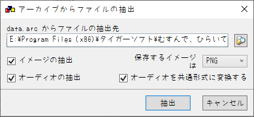
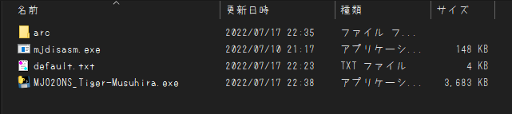

# MJO2ONS_Tiger-Musuhira
## なにこれ
  2006年にタイガーソフト様から発売された、18禁PC向けノベルゲーム'[むすんで、ひらいて。](https://web.archive.org/web/20070306101142fw_/http://www.tiger-soft.com/musunde/index.htm)'を 
  ONScripter形式へ変換するためのコンバータ...になる予定のプログラムです 
   
  現在は[体験版](https://kokoron.madoka.org/mirror/tiger-soft.html)のコンバートのみ可能な状況です 
  ~~金欠で製品版買えてないんだよね...~~ 

## 再現度
原作との違いは主に以下
 - タイトル画面が現時点では未実装(製品版対応時に実装予定)
 - 立ち絵の明度の上げ下げ未実装(夜でもキャラが明るい)
 - 選択肢の見た目が手抜き ~~実はにじみて昆布も大体一緒~~
 - クリック待ちカーソルの仕様が原作と違う
 - 画面遷移処理は全部フェードで代用
 - その他UI~~いつも通り~~最低限

## 使い方
 1. 適当な作業フォルダを作成
 2. [mjdisasm.exe](https://github.com/Inori/FuckGalEngine/blob/master/Majiro/mjdev/mjdisasm.exe)をDLし作業フォルダへ移動
 3. [GARBro](https://drive.google.com/file/d/1gH9nNRxaz8GexN0B1hWyUc3o692bkWXX/view)で全部の"xx.arc"を"arc"という名前のフォルダを作業フォルダ直下に作成し展開 

     設定は以下の通り↓ 
      
 4. 展開先のディレクトリで[このコンバータ](https://github.com/Prince-of-sea/MJO2ONS_Tiger-Musuhira/releases/latest)をDL/起動させ変換(最低でも数分程度はかかります) 
    変換前の時点で以下のような構成になっていればOKです↓ 
     
 5. ウィンドウが消え、0.txtができれば完成 
    不要データを削除し、変換済みファイルと共に利用ハードへ転送

## 注意事項
 - 当然ですが公式ツールではありません
 - 現時点では __Web体験版でのみ動作確認しています__ パッケージ版の動作は未確認
 - 本ツールの使用において生じた問題や不利益などについて、作者は一切の責任を負いません

## その他
 - 本作の変換を追加でサポートする[PSP向け自動変換ツール作ってます](https://github.com/Prince-of-sea/ONScripter_Multi_Converter) 
    もしPSPで遊ぶ場合はぜひご利用ください(v1.2.9以上推奨)